# Architecture

Arnold Pipeline is a Ruby gem that transforms natural language application descriptions into executable code through a multi-agent AI pipeline. It operates as both a standalone CLI tool (backed by SQLite) and a Rails engine.

**Stats:** 372 files, 464 symbols, 2063 tests, 13 CLI commands, 20 MCP tools

## High-Level Architecture

```mermaid
graph TB
    subgraph CLI["CLI Layer (Thor)"]
        RUN[run]
        RESUME[resume]
        ITERATE[iterate]
        ANALYZE[analyze]
        STATUS[status / list / log]
        SPEC_CMD[spec / tasks]
        MCP_CMD[mcp]
        SETUP[setup / doctor]
    end

    subgraph Core["Core Pipeline"]
        ORCH[Orchestrator]
        AL[AnalysisLoop]
        TEE[TierExecutionEngine]
        TC[TierCalculator]
        RI[ResumeInferrer]
        DM[DeltaMerger]
        PER[PipelineEventRecorder]
    end

    subgraph Agents["AI Agents"]
        SG[SpecGenerator]
        TB_A[TaskBreaker]
        EXEC[Executor]
        ANA[Analyzer]
        TGC[TierGateCheck]
        SI[SpecIterator]
        DD[DriftDetector]
    end

    subgraph Brownfield["Brownfield Analysis"]
        SD[StackDetector]
        AD[ArtifactDiscoverer]
        OR_B[OverlayResolver]
        FMB[FileManifestBuilder]
        RTP[RouteTableParser]
        GAA[GitActivityAnalyzer]
        TNC[TestNameCollector]
        HBR[HealthBaselineRunner]
        PAR[ParallelAgentRunner]
        subgraph BF_Agents["Brownfield Agents"]
            INFRA[InfrastructureAgent]
            DMODEL[DataModelAgent]
            BLOG[BusinessLogicAgent]
            CROUTE[ControllerRouteAgent]
            VUX[ViewUxAgent]
            SYNTH[SynthesisAgent]
        end
    end

    subgraph Providers["Providers"]
        subgraph LLM["LLM Providers"]
            ANTH[Anthropic]
            OAI[OpenAI]
            ORT[OpenRouter]
        end
        subgraph EXEC_P["Execution Providers"]
            GH[GitHub]
            CC[Claude Code]
            NP[Null]
        end
    end

    subgraph Library["Library (YAML)"]
        PERS[Personas<br/>6 types]
        REC[Recipes<br/>7 types]
        DOM[Domain Types<br/>13 types]
    end

    subgraph MCP["MCP Server"]
        HANDLER[Handler]
        TOOLS[20 Tools]
    end

    subgraph Data["Data Layer (ActiveRecord)"]
        PR[PipelineRun]
        SPEC_M[Specification]
        TASK_M[Task]
        ITER[Iteration]
        PE[PipelineEvent]
        SR[SpecRevision]
        SD_M[SpecDelta]
        DF[DriftFinding]
        CP[CodebaseProfile]
    end

    %% CLI to Core
    RUN --> ORCH
    RESUME --> ORCH
    ITERATE --> ORCH
    ANALYZE --> ORCH
    MCP_CMD --> HANDLER

    %% Core orchestration
    ORCH --> SG
    ORCH --> TB_A
    ORCH --> TEE
    ORCH --> AL
    ORCH --> SI
    ORCH --> DM

    %% Tier execution
    TEE --> EXEC
    TEE --> TGC
    TC -.-> TEE

    %% Analysis loop
    AL --> ANA
    AL --> TB_A
    AL --> TEE
    AL --> DM

    %% Agents to LLM
    SG --> LLM
    TB_A --> LLM
    ANA --> LLM
    SI --> LLM
    TGC --> LLM

    %% Executor to Execution Providers
    EXEC --> EXEC_P

    %% Library usage
    ORCH --> Library
    AL --> Library

    %% Brownfield flow
    ORCH --> SD
    ORCH --> AD
    ORCH --> OR_B
    ORCH --> PAR
    PAR --> BF_Agents
    BF_Agents --> LLM
    ORCH --> SYNTH
    ORCH --> HBR

    %% MCP
    HANDLER --> TOOLS
    TOOLS --> Data

    %% Core to Data
    ORCH --> Data
    AL --> Data
    TEE --> Data
    PER --> PE

    classDef cli fill:#4a9eff,stroke:#333,color:#fff
    classDef core fill:#ff9f43,stroke:#333,color:#fff
    classDef agent fill:#a55eea,stroke:#333,color:#fff
    classDef brown fill:#26de81,stroke:#333,color:#fff
    classDef provider fill:#fc5c65,stroke:#333,color:#fff
    classDef library fill:#fed330,stroke:#333,color:#000
    classDef mcp fill:#20bf6b,stroke:#333,color:#fff
    classDef data fill:#778ca3,stroke:#333,color:#fff

    class RUN,RESUME,ITERATE,ANALYZE,STATUS,SPEC_CMD,MCP_CMD,SETUP cli
    class ORCH,AL,TEE,TC,RI,DM,PER core
    class SG,TB_A,EXEC,ANA,TGC,SI,DD agent
    class SD,AD,OR_B,FMB,RTP,GAA,TNC,HBR,PAR,INFRA,DMODEL,BLOG,CROUTE,VUX,SYNTH brown
    class ANTH,OAI,ORT,GH,CC,NP provider
    class PERS,REC,DOM library
    class HANDLER,TOOLS mcp
    class PR,SPEC_M,TASK_M,ITER,PE,SR,SD_M,DF,CP data
```



## Functional Areas

### 1. CLI Layer

**Path:** `lib/arnold_pipeline/cli.rb`, `lib/arnold_pipeline/cli/`

Thor-based CLI with 13 commands. Manages standalone SQLite setup, config loading (user config < explicit config < CLI flags), and error handling.

| Command | Purpose |
|---------|---------|
| `run` | Execute full pipeline from NL description |
| `resume` | Resume paused/failed run |
| `iterate` | Iterate on spec with change request (or fork completed runs) |
| `analyze` | Brownfield codebase analysis |
| `status` | Show pipeline run status |
| `list` | List all pipeline runs |
| `spec` | Export specification (with history/version support) |
| `tasks` | Export task list |
| `log` | Show event audit trail |
| `mcp` | Start MCP server over stdio |
| `setup` | Interactive first-use configuration |
| `doctor` | Environment health check |
| `version` | Show version |

### 2. Orchestrator (Core Pipeline)

**Path:** `lib/arnold_pipeline/orchestrator.rb`

Central coordinator that drives the four-stage pipeline:

```
generate_spec → break_tasks → execute → analyze
```

Key responsibilities:
- Stage sequencing with `STAGES = [:generate_spec, :break_tasks, :execute, :analyze]`
- Checkpoint-based pause/resume (`STAGE_CHECKPOINTS = {generate_spec: :spec, break_tasks: :tasks, execute: :executed}`)
- Spec iteration (`iterate_spec!`, `iterate_spec_dry_run!`)
- Pipeline forking from completed runs (`fork!`)
- Brownfield codebase analysis (`analyze_codebase!`)
- Post-pipeline finalization (worktree cleanup, recipe hooks, verification checks)
- Event recording throughout all stages

### 3. AI Agents

**Path:** `lib/arnold_pipeline/agents/`

All agents inherit from `BaseAgent`, which provides LLM communication (`chat`, `chat_json`), JSON parsing with repair, and logging.

| Agent | Role |
|-------|------|
| `SpecGenerator` | NL input + persona/recipe/domain → structured spec |
| `TaskBreaker` | Spec → 5-20 ordered tasks with dependencies |
| `Executor` | Dispatches tasks to execution providers |
| `Analyzer` | Post-execution QA: decides `done`, `iterate_tasks`, or `iterate_spec` |
| `TierGateCheck` | Validates tier completion before advancing |
| `SpecIterator` | Generates spec deltas from change requests |
| `DriftDetector` | Detects spec-vs-code drift |
| `ConcernDiffAnalyzer` | Analyzes concern-level diffs for brownfield |

### 4. Brownfield Analysis Subsystem

**Path:** `lib/arnold_pipeline/brownfield/`, `lib/arnold_pipeline/agents/brownfield/`

Analyzes existing codebases to produce an "as-built" specification. Eight-step pipeline:

1. **StackDetector** — Language/framework identification with confidence scoring
2. **ArtifactDiscoverer** — Finds config files, manifests, CI configs
3. **OverlayResolver** — Resolves stack-specific analysis overlays
4. **FileManifestBuilder** — Builds categorized file inventory
5. **RouteTableParser** — Extracts route definitions
6. **GitActivityAnalyzer** — Analyzes commit frequency/recency per file
7. **TestNameCollector** — Discovers test names grouped by concern
8. **ParallelAgentRunner** — Runs 5 specialized LLM agents concurrently:
   - `InfrastructureAgent` — Build tools, CI/CD, conventions
   - `DataModelAgent` — Schemas, models, relationships
   - `BusinessLogicAgent` — Services, domain logic
   - `ControllerRouteAgent` — Endpoints, routing
   - `ViewUxAgent` — Frontend, templates, UX patterns
9. **SynthesisAgent** — Merges all agent outputs into a unified as-built spec
10. **HealthBaselineRunner** — Runs convention-based health checks

### 5. Tier System

**Path:** `lib/arnold_pipeline/tier_calculator.rb`, `lib/arnold_pipeline/tier_execution_engine.rb`

Tasks are organized into dependency tiers (tier 0 = no dependencies, tier N = depends on tier N-1).

- **TierCalculator** — Topological sort via recursive depth computation; detects cycles
- **TierExecutionEngine** — Executes tiers sequentially, tasks within a tier concurrently:
  - Context propagation between tiers (diffs, comments from prior tiers)
  - Tier gate checks (LLM-verified quality gates)
  - Retry logic with configurable max retries
  - Merge conflict resolution
  - Post-merge hooks and verification checks
  - Test execution and acceptance criteria checking
  - Worktree-based parallel execution (Claude Code provider)

### 6. Analysis Loop

**Path:** `lib/arnold_pipeline/analysis_loop.rb`

Feedback loop after execution. Iterates up to `max_iterations` (1-10, default 3):

1. Analyze diffs against spec (via Analyzer agent)
2. Decision routing:
   - `done` → Complete pipeline, merge results
   - `iterate_tasks` → Generate corrective tasks, re-execute
   - `iterate_spec` → Apply spec deltas, re-break tasks, re-execute
3. Safeguards:
   - High-confidence promotion (`iterate_tasks` → `done` when confidence >= threshold)
   - Spec version skew suppression (suppresses `iterate_spec` when spec already updated)
   - Dependency cycle detection via Kahn's algorithm

### 7. Providers

**Path:** `lib/arnold_pipeline/providers/`

#### LLM Providers
All implement `chat(messages:, system:)` and `chat_json(messages:, system:, schema:)`:

| Provider | Default Model |
|----------|--------------|
| Anthropic | claude-sonnet-4-6 |
| OpenAI | gpt-5-mini-2025-08-07 |
| OpenRouter | anthropic/claude-sonnet-4 |

#### Execution Providers
All implement `create_tasks`, `fetch_results`, `merge_results`:

| Provider | Mode | Mechanism |
|----------|------|-----------|
| GitHub | Async | Issues → Actions/Copilot → PRs, with polling |
| Claude Code | Sync | CLI subprocess per task, worktree isolation |
| Null | Sync | No-op (for preview/dry-run) |

Provider registry supports custom execution providers via `Providers::Execution.register`.

### 8. Library

**Path:** `library/`

YAML-based knowledge base with keyword matching:

- **Personas** (6): Software Architect, Domain Expert, Frontend Engineer, General Analyst, QA Analyst, Testing Specialist
- **Recipes** (7): Web App, API Service, CLI Tool, Bot/Agent, Mobile App, Landing Page, Generic
- **Domain Types** (13): Analytics, Content, Creative, Education, Fintech, Game, Generic, Health, IoT, Marketplace, Productivity, Service, Social

The `Library::Manager` performs keyword-based retrieval with fallback to generic types on mismatch. Recipes include framework guidance, section templates, verification checks, and finalization commands.

### 9. MCP Server

**Path:** `lib/arnold_pipeline/mcp/`

JSON-RPC server (stdio transport) implementing MCP protocol v2025-03-26. Provides 20 tools for Claude Code plugin integration:

| Category | Tools |
|----------|-------|
| Project | `create_product`, `init_project`, `describe_product` |
| Spec | `get_spec`, `propose_change`, `confirm_change` |
| Tasks | `get_tasks`, `start_task`, `complete_task`, `validate_tier` |
| Exploration | `explore_domain`, `explore_architecture`, `explore_persona`, `explore_capability`, `explain_recipe` |
| Quality | `detect_drift`, `resolve_drift`, `report_issue`, `what_if` |
| Collaboration | `ask_engineer`, `get_history` |

### 10. Data Layer

**Path:** `app/models/arnold_pipeline/`, `db/migrate/`

ActiveRecord models backed by SQLite (standalone) or the host Rails database:

| Model | Purpose |
|-------|---------|
| `PipelineRun` | Top-level run record with status machine |
| `Specification` | Generated spec content + structured data, versioned |
| `SpecRevision` | Version history with delta summaries |
| `SpecDelta` | Individual delta operations (add/modify/remove) |
| `Task` | Execution unit with tier, position, dependencies, acceptance criteria |
| `Iteration` | Analysis loop iteration with decision/confidence/reasoning |
| `PipelineEvent` | Audit trail with timing, stage, tier/iteration context |
| `DriftFinding` | Spec-vs-code drift detections |
| `CodebaseProfile` | Brownfield analysis results |

### 11. Supporting Components

| Component | Path | Purpose |
|-----------|------|---------|
| `Configuration` | `lib/arnold_pipeline/configuration.rb` | Centralized config with validation, provider auto-detection |
| `DeltaMerger` | `lib/arnold_pipeline/delta_merger.rb` | Applies structured spec deltas (add/modify/remove) |
| `DeltaPresenter` | `lib/arnold_pipeline/delta_presenter.rb` | Formats deltas for CLI display |
| `DiffSummarizer` | `lib/arnold_pipeline/diff_summarizer.rb` | Compresses code diffs for LLM context |
| `ResumeInferrer` | `lib/arnold_pipeline/resume_inferrer.rb` | Determines correct resume stage from run state |
| `PipelineEventRecorder` | `lib/arnold_pipeline/pipeline_event_recorder.rb` | Records timed events to audit trail |
| `LogFormatter` | `lib/arnold_pipeline/log_formatter.rb` | Formats event logs for terminal display |
| `PostMergeHookRunner` | `lib/arnold_pipeline/post_merge_hook_runner.rb` | Runs configurable post-merge shell commands |
| `VerificationRunner` | `lib/arnold_pipeline/verification_runner.rb` | Runs configurable verification checks |
| `CorrectiveTaskGenerator` | `lib/arnold_pipeline/corrective_task_generator.rb` | Generates fix tasks from analysis feedback |
| `RepoContextScanner` | `lib/arnold_pipeline/repo_context_scanner.rb` | Scans target repo for context files |
| `OpenspecBridge` | `lib/arnold_pipeline/openspec_bridge.rb` | Integration with OpenSpec CLI |
| `CriteriaChecker` | `lib/arnold_pipeline/criteria_checker.rb` | Validates acceptance criteria |

## Key Execution Flows

### Flow 1: Full Pipeline Run (`arnold run`)

```
CLI.run_pipeline
  → setup_standalone! (SQLite + migrations)
  → load_config! (user → file → CLI flags)
  → Orchestrator.call(nl_input:)
    → Configuration.validate!
    → PipelineRun.create!(status: :pending)
    → generate_spec!
    │   → LibraryManager.find_persona/recipes/domain_type
    │   → SpecGenerator.call → LLM
    │   → Specification.create! + SpecRevision.create!
    → break_tasks!
    │   → TaskBreaker.call → LLM
    │   → Task.create! (5-20 tasks)
    │   → TierCalculator.call (assign tiers)
    → execute! (via TierExecutionEngine)
    │   → For each tier 0..N:
    │       → Execute tier tasks (concurrently within tier)
    │       → Fetch/poll results
    │       → Merge results (worktree → main branch)
    │       → Run post-merge hooks
    │       → Run verification checks
    │       → TierGateCheck (quality gate)
    → analyze! (via AnalysisLoop)
        → For iteration 1..max:
            → Analyzer.call(spec, diffs) → LLM
            → Route on decision: done | iterate_tasks | iterate_spec
            → If iterating: re-break tasks → re-execute → re-analyze
```

### Flow 2: Brownfield Analysis (`arnold analyze`)

```
CLI.analyze
  → Orchestrator.analyze_codebase!(repo_path:)
    → PipelineRun.create!(status: :pending → :analyzing)
    → StackDetector.call → {language, framework, confidence}
    → ArtifactDiscoverer.call → [{path, type}]
    → OverlayResolver.call → overlay config
    → FileManifestBuilder.call → [{path, category, size}]
    → RouteTableParser.call → [{method, path, handler}]
    → GitActivityAnalyzer.call → [{file, commits, recency}]
    → TestNameCollector.call → {framework, grouped_by_concern}
    → ParallelAgentRunner.run (5 agents concurrently) → LLM
    │   → Infrastructure, DataModel, BusinessLogic, ControllerRoute, ViewUx
    → SynthesisAgent.call (merge agent outputs) → LLM
    → HealthBaselineRunner.call (run health checks)
    → Specification.create!(spec_type: "as_built")
    → CodebaseProfile.create!
```

### Flow 3: Spec Iteration (`arnold iterate`)

```
CLI.iterate
  → If completed → fork! (new PipelineRun, copy spec, apply deltas, pause)
  → If --dry-run → iterate_spec_dry_run! (show deltas, no apply)
  → Otherwise:
    → Orchestrator.iterate_spec!(pipeline_run:, change_request:)
      → SpecIterator.call(spec_content, change_request) → LLM → deltas
      → Mark existing tasks as superseded
      → DeltaMerger.apply!(spec, deltas)
      → Return {pipeline_run, deltas, spec_version}
```

### Flow 4: Tier Execution Detail

```
TierExecutionEngine.execute_tiers!(pipeline_run)
  → For tier in 0..max_tier:
    → Skip fully resolved tiers (resume support)
    → Build prior_context (accumulated diffs + comments)
    → Executor.create_tasks (dispatch to provider)
    │   GitHub: Create issues → poll for PRs
    │   Claude Code: Spawn CLI subprocesses in worktrees
    → Executor.fetch_results (collect diffs/comments)
    → For each completed task:
    │   → Merge results (resolve conflicts if needed)
    │   → Run post-merge hooks
    │   → Run verification checks
    │   → Run tests + check acceptance criteria
    → TierGateCheck (if enabled)
    │   → LLM evaluates tier quality
    │   → If failed: retry (up to max_tier_retries) or pause pipeline
    → Accumulate context for next tier
```

### Flow 5: Resume Pipeline (`arnold resume`)

```
CLI.resume
  → Orchestrator.resume(pipeline_run:)
    → ResumeInferrer.call(pipeline_run) → infer resume stage
    │   Based on: paused_at checkpoint, task statuses, current status
    → run_pipeline!(from: inferred_stage)
    → Continues from the appropriate stage
    → Tier execution skips already-completed tiers
```
